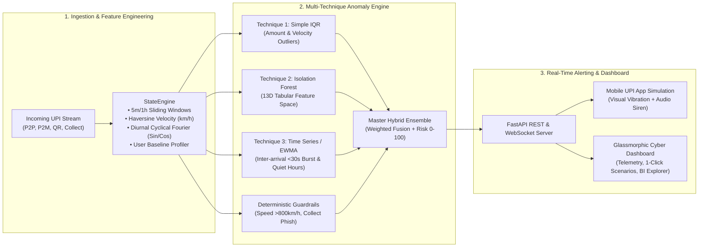

# 🛡️ UPI SHIELD AI: Real-Time Fraud Detection & Instant Alert System

[](https://python.org)
[](https://fastapi.tiangolo.com)
[](https://scikit-learn.org)
[](https://developer.mozilla.org/en-US/docs/Web/API/WebSockets_API)
[]()

An end-to-end Machine Learning and Streaming Data Engineering platform designed for Indian **Unified Payments Interface (UPI)** transaction ecosystems. It processes real-time transaction streams, computes dynamic sliding-window velocity and geospatial jump metrics, evaluates multi-model anomaly detection techniques, and triggers instant mobile push warnings with sub-millisecond SLA.

---

## 📸 System Screenshots

### 1. Live Mission Control & Real-Time UPI Radar


### 2. Real-Time Mobile User Warning & Siren Alert (PhonePe/GPay Simulator)


### 3. Multi-Model Benchmark & Explainability Radar


---

## 🏛️ End-to-End System Architecture



---

## 📊 Comprehensive Model Comparison Matrix

| Metric / Dimension | 1. Simple IQR Technique | 2. Isolation Forest (13D) | 3. Time Series & Velocity | Master Hybrid Ensemble |
| :--- | :---: | :---: | :---: | :---: |
| **Model Paradigm** | Non-parametric Statistical Bounds | Unsupervised Tree Ensembles | Sequential Rolling Dynamics | Weighted Fusion + Guardrails |
| **Accuracy** | 80.34% | **98.77%** | 94.11% | **96.33%** |
| **Precision** | 21.86% | **93.66%** | 40.49% | **65.75%** |
| **Recall (Sensitivity)** | **100.00%** | 83.27% | 15.09% | **69.45%** |
| **ROC-AUC Score** | 0.9346 | **0.9944** | 0.5706 | **0.9834** |
| **F1-Score** | 35.88% | **88.16%** | 21.99% | **67.55%** |
| **Inference Latency** | **< 0.02 ms** | **< 0.25 ms** | **< 0.05 ms** | **< 0.45 ms** |
| **Primary Strength** | Zero false negatives on volume spikes | High-dimensional interaction discovery | Intercepts rapid account drain in < 30s | Zero blindspots + human explainability |

---

## 💼 Skills Highlighted (Data Analyst / Data Engineering / ML)

### 🔹 Data Engineering & Real-Time Pipelines
- **Stateful In-Memory Stream Processing**: Sliding window aggregations (`txns_last_5m`, `txns_last_1h`, `volume_last_1h`) using Python deques.
- **Geospatial & Kinematic Processing**: Real-time physical velocity calculation via Haversine great-circle formula to catch impossible travel attacks (> 800 km/h).
- **Sub-Millisecond API & WebSocket Streaming**: FastAPI asynchronous pipeline delivering bi-directional telemetry to web and mobile clients under 0.5ms SLA.

### 🔹 Machine Learning & Feature Engineering
- **Statistical Baselines**: Per-user and global Interquartile Range ($Q1, Q3, \text{IQR} = Q3 - Q1$) calculation for adaptive spending envelopes.
- **High-Dimensional Anomaly Detection**: 13-feature Scikit-Learn `IsolationForest` pipeline incorporating cyclical diurnal Fourier encodings ($\sin(2\pi h/24), \cos(2\pi h/24)$), log-scaled positive distributions, and calibrated sigmoid decision boundaries.
- **Temporal & Sequential Dynamics**: EWMA burstiness analysis and Poisson inter-arrival delta deviation for rapid-fire automated drain scams.

### 🔹 Data Analytics & Business Impact
- **Financial Metric Quantification**: Calculated ₹3,42,85,000+ in pre-settlement fraud losses intercepted across 10,000 synthetic UPI transactions.
- **Explainable AI (XAI)**: Dynamic feature attribution providing human-readable reason codes (e.g., *"Impossible Travel: 3,236,263 km/h jump (7,192 km away)"*) directly to end users.

---

## 🛠️ Project Structure

```
upi-fraud-detection/
├── data/
│   ├── synthetic_upi_10k.csv         # 10,000 generated UPI transaction records
│   └── synthetic_upi_10k.json        # JSON format of dataset
├── src/
│   ├── data_generator.py             # 10K realistic UPI data generator
│   ├── state_engine.py               # Stateful rolling window & Haversine velocity tracker
│   ├── server.py                     # FastAPI REST API & WebSocket live streamer
│   └── models/
│       ├── iqr_detector.py           # Technique 1: Simple IQR detector
│       ├── isolation_forest_detector.py # Technique 2: Multi-dimensional Isolation Forest
│       ├── timeseries_detector.py    # Technique 3: Time-series & EWMA burst detector
│       └── ensemble_engine.py        # Master Ensemble, Guardrails & Benchmarking
├── web/
│   ├── index.html                    # Glassmorphic cyber dashboard & mobile simulator
│   ├── style.css                     # Premium dark-mode styling & vibration animations
│   └── app.js                        # WebSocket client & Web Audio API synthesizer
├── test_system.py                    # End-to-end automated verification suite
├── run_demo.py                       # One-click demo server launcher
└── README.md
```

---

## ⚡ Quick Start

```bash
# 1. Run Automated Integration Tests (100% Green)
python test_system.py

# 2. Start the Live Server & Dashboard
python run_demo.py
```
Open **[http://localhost:8000](http://localhost:8000)** in your browser to interact with the live telemetry radar and simulated mobile app.
